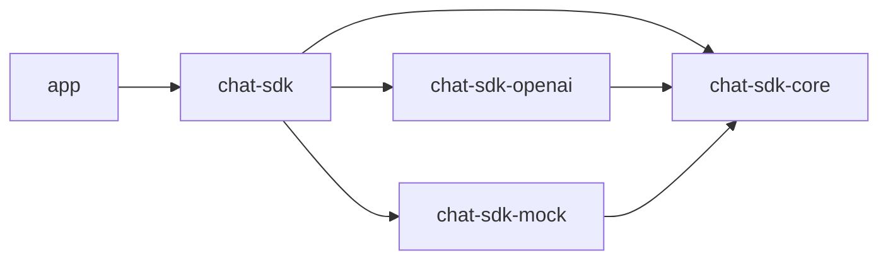
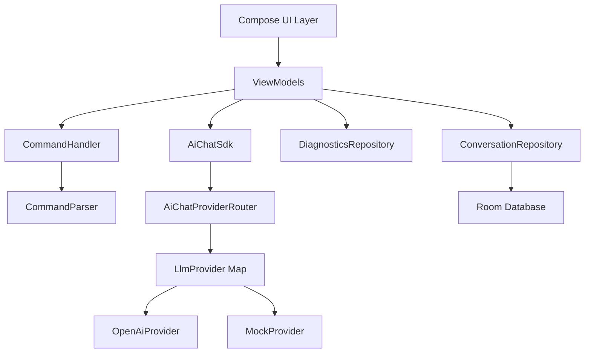

# AI Chat App

A modern Android chat application with a modular, pluggable AI SDK architecture supporting multiple LLM providers, built with Jetpack Compose and following SOLID principles.

<p align="center">
  
  
  
  
</p>

## 🎯 Key Features

- **Multi-Provider LLM Support** - Seamlessly switch between OpenAI, Mock, and custom providers
- **Real-Time Streaming** - See AI responses as they're generated with Flow-based streaming
- **Conversation Persistence** - Local database storage with Room for chat history
- **Powerful Command System** - In-chat commands for configuration without leaving the conversation
- **Performance Diagnostics** - Track request metrics, latency, token usage, and errors
- **Modular SDK Architecture** - Clean separation between UI and SDK layers
- **100% Jetpack Compose** - Modern, declarative UI with Material 3
- **Comprehensive Testing** - 57+ unit tests with MockK for command system validation

---

## 📐 Architecture

### Module Structure

The project follows a **multi-module architecture** designed for maximum reusability, testability, and pluggability:



### Module Descriptions

| Module | Purpose | Key Components |
|--------|---------|----------------|
| **`app/`** | Android UI layer | Compose screens, ViewModels, Navigation, DI setup |
| **`chat-sdk/`** | SDK aggregator | Provider registration, NetworkModule, AiChatSdk |
| **`chat-sdk-core/`** | Core interfaces | `LlmProvider`, `StreamEvent`, `ChatMessage`, Provider config |
| **`chat-sdk-openai/`** | OpenAI implementation | OpenAI API integration, streaming responses |
| **`chat-sdk-mock/`** | Mock provider | Testing provider with simulated responses |

### Architecture Layers



**Key Design Principles:**
- **Dependency Inversion**: App depends on interfaces, not implementations
- **Plugin Architecture**: New providers can be added without modifying core
- **Single Source of Truth**: SDK manages configuration, UI observes state
- **Clean Separation**: UI layer has zero knowledge of provider implementations

---

## 🛠 Tech Stack

### Core Technologies
- **Kotlin** 2.0.21 - Modern, concise, safe language
- **Jetpack Compose** 2024.12.01 - Declarative UI framework
- **Material 3** - Latest Material Design components
- **Coroutines** 1.9.0 - Structured concurrency for async operations
- **Flow** - Reactive streams for state management

### Android Architecture Components
- **Hilt** 2.52 - Dependency injection framework
- **Room** 2.6.1 - Local database persistence
- **ViewModel** 2.8.7 - UI state management
- **Navigation Compose** 2.8.5 - Type-safe navigation

### Networking
- **Retrofit** 2.11.0 - HTTP client for REST APIs
- **OkHttp** 4.12.0 - Network interceptors and logging
- **Kotlinx Serialization** 1.7.3 - JSON parsing

### Testing
- **JUnit** 4.13.2 - Unit testing framework
- **MockK** 1.13.13 - Mocking library for Kotlin
- **Coroutines Test** 1.9.0 - Testing coroutines and Flow

---

## 🚀 Getting Started

### Prerequisites

- **Android Studio** Hedgehog (2023.1.1) or later
- **JDK** 17 or higher
- **Android SDK** with minimum API level 24
- **OpenAI API Key** (for OpenAI provider)

### Setup Instructions

#### 1. Clone the Repository

```bash
git clone https://github.com/yourusername/ai-chat-app.git
cd ai-chat-app
```

#### 2. Configure API Key

Create a `local.properties` file in the project root:

```properties
OPENAI_API_KEY=your_openai_api_key_here
```

> **Note**: The API key is loaded via `BuildConfig` in [`chat-sdk-openai/build.gradle`](chat-sdk-openai/build.gradle) and is never committed to version control.

#### 3. Sync and Build

Open the project in Android Studio and sync Gradle files, or use the command line:

```bash
./gradlew build
```

#### 4. Run Tests

```bash
./gradlew testDebugUnitTest
```

#### 5. Run the App

Connect a device or start an emulator, then:

```bash
./gradlew installDebug
```

Or use Android Studio's Run button.

---

## 💡 Features

### Chat Interface
- **Streaming Responses**: See AI replies appear in real-time
- **Message History**: Scroll through past conversations
- **Auto-Scroll**: Automatically follows new messages
- **Input Persistence**: Text preserved during navigation

### Conversation Management
- **Persistent History**: Conversations saved locally with Room
- **Lazy Creation**: Conversations only created when first message sent
- **Smart Titles**: First user message becomes conversation title
- **Delete**: Remove conversations
- **Load Previous Chats**: Resume any past conversation

### Settings Screen
- **Provider Selection**: Switch between OpenAI, Mock, and future providers
- **Model Selection**: Choose from available models per provider
- **Temperature Control**: Slider with visual color feedback (0.0 - 2.0)
  - 🔵 0.0-0.2: Consistent/factual
  - 🟢 0.5-0.8: Natural/creative
  - 🔴 1.0+: Very creative/surprising
- **Token Limit**: Configure max response length
- **Live Validation**: All settings validated before saving

### Diagnostics Screen
- **Performance Metrics**: Total requests, success/failure counts
- **Token Usage**: Track prompt, completion, and total tokens
- **Request Logs**: Detailed history with latency and error info
- **Real-Time Updates**: Metrics update as you chat

### Chat Commands

All commands are documented in detail in [`COMMANDS.md`](COMMANDS.md). Quick reference:

| Command | Description | Example |
|---------|-------------|---------|
| `/help` | Show all available commands | `/help` |
| `/clear` | Clear conversation and delete from DB | `/clear` |
| `/model` | Change model or provider+model | `/model openai:gpt-4o` |
| `/temp` | Set temperature (0.0-2.0) | `/temp 0.7` |
| `/tokens` | Set max tokens | `/tokens 1000` |
| `/config` | Show current configuration | `/config` |
| `/stats` | Show performance statistics | `/stats` |

**Command Features:**
- ✅ Case-insensitive command names
- ✅ Live validation against SDK state
- ✅ Inline feedback in chat
- ✅ Comprehensive error messages

---

## 🏗 Design Decisions

### 1. Multi-Module SDK Architecture

**Rationale:**
- **Pluggability**: Add new providers (Anthropic, Google, etc.) without modifying core
- **Testability**: Mock provider eliminates need for API keys in tests
- **Reusability**: SDK modules can be extracted for use in other projects
- **Separation of Concerns**: Each module has a single, clear responsibility

**Implementation:**
- Core interfaces in [`chat-sdk-core/src/main/java/com/hezi/chatsdk/core/providers/LlmProvider.kt`](chat-sdk-core/src/main/java/com/hezi/chatsdk/core/providers/LlmProvider.kt)
- Provider registration via Hilt's `@IntoMap` in [`chat-sdk/src/main/java/com/hezi/chatsdk/di/ProviderModule.kt`](chat-sdk/src/main/java/com/hezi/chatsdk/di/ProviderModule.kt)

### 2. Dependency Injection with Hilt

**Rationale:**
- **Type Safety**: Compile-time dependency resolution
- **Scoping**: Proper lifecycle management with `@Singleton`
- **Map Multibindings**: Elegant provider registration pattern
- **Qualifiers**: Distinguish between similar types (API keys, provider info)

**Key Patterns:**
```kotlin
@Provides
@IntoMap
@ProviderName(OPEN_AI_PROVIDER_NAME)
@Singleton
fun provideOpenAiProvider(...): LlmProvider
```

### 3. Interface-Based Command System

**Rationale:**
- **Testability**: Easy to mock for unit tests
- **Single Responsibility**: Parser validates, Handler executes
- **Type Safety**: Sealed classes for command results

**Architecture:**
- [`CommandParser`](app/src/main/java/com/hezi/aichatapp/commands/CommandParser.kt) - Validates input against SDK state
- [`CommandHandler`](app/src/main/java/com/hezi/aichatapp/commands/CommandHandler.kt) - Executes commands and returns results
- Sealed `CommandResult`: `Handled(Message | ClearHistory)` or `NotHandled`

### 4. Lazy Conversation Creation

**Rationale:**
- Avoids empty conversation entries cluttering the database
- First user message provides natural title
- Better user experience (no "New Chat" spam)

**Implementation:**
In [`ChatViewModel.kt`](app/src/main/java/com/hezi/aichatapp/ui/chat/ChatViewModel.kt):
```kotlin
private fun sendAiMessage(text: String) {
    var convId = currentConversationId
    if (convId == null) {
        convId = createNewConversation(firstMessage = text)
    }
    // ... save messages
}
```

### 5. Commands Not Persisted to Database

**Rationale:**
- Commands are configuration, not conversation content
- Keeps conversation history clean and meaningful
- Easier to export/share conversations
- Reduces database size

**Implementation:**
- Commands use `UiMessageType.SYSTEM` (not saved to DB)
- Only `USER` and `ASSISTANT` messages persisted
- Command results shown as transient UI messages

### 6. Repository Pattern for Data Layer

**Rationale:**
- **Abstraction**: ViewModel doesn't know about Room implementation
- **Testability**: Easy to mock repository in ViewModel tests
- **Flexibility**: Can swap database implementation without changing ViewModel

**Structure:**
- [`ConversationRepository`](app/src/main/java/com/hezi/aichatapp/data/repository/ConversationRepository.kt) - Interface
- [`ConversationRepositoryImpl`](app/src/main/java/com/hezi/aichatapp/data/repository/ConversationRepositoryImpl.kt) - Room implementation

### 7. SOLID Principles in Practice

| Principle | Implementation |
|-----------|----------------|
| **Single Responsibility** | Each module/class has one clear purpose |
| **Open/Closed** | Add providers without modifying core |
| **Liskov Substitution** | All providers interchangeable via `LlmProvider` |
| **Interface Segregation** | Minimal, focused interfaces |
| **Dependency Inversion** | App depends on abstractions, not concrete classes |

---

## 🧪 Testing

### Test Coverage

The project includes **57+ unit tests** covering:
- ✅ Command parsing (41 tests) - All command types, validation, edge cases
- ✅ Command handling (16 tests) - Execution, SDK integration, diagnostics
- ✅ Provider configuration validation
- ✅ Error handling and edge cases

### Test Files
- [`ChatCommandParserTest.kt`](app/src/test/java/com/hezi/aichatapp/commands/ChatCommandParserTest.kt)
- [`ChatCommandHandlerTest.kt`](app/src/test/java/com/hezi/aichatapp/commands/ChatCommandHandlerTest.kt)

### Running Tests

```bash
# Run all unit tests
./gradlew testDebugUnitTest

# Run specific test class
./gradlew testDebugUnitTest --tests ChatCommandParserTest
./gradlew testDebugUnitTest --tests ChatCommandHandlerTest

# Run with coverage
./gradlew testDebugUnitTest jacocoTestReport
```

### Testing Tools
- **JUnit 4** - Test framework
- **MockK** - Mocking library with Kotlin DSL
- **Coroutines Test** - Testing async code
- **Hilt Testing** - DI support in tests

---

## 🔌 Adding a New LLM Provider

The SDK is designed to make adding providers straightforward. Follow these steps:

### Step 1: Create Provider Module

Create a new Android library module:

```bash
chat-sdk-{provider}/
├── build.gradle
└── src/main/java/com/hezi/chatsdk/{provider}/
    ├── {Provider}ApiService.kt       # Retrofit interface
    ├── {Provider}Models.kt            # Request/response models
    ├── {Provider}Provider.kt          # LlmProvider implementation
    └── di/
        ├── {Provider}Module.kt        # Hilt DI module
        └── Qualifiers.kt              # Custom qualifiers
```

### Step 2: Add Dependencies

In `build.gradle`:
```gradle
dependencies {
    api project(':chat-sdk-core')
    implementation libs.retrofit
    implementation libs.kotlinx.serialization.json
    implementation libs.hilt.android
    ksp libs.hilt.compiler
}
```

### Step 3: Implement LlmProvider

```kotlin
class YourProvider @Inject constructor(
    private val apiService: YourApiService,
    @YourApiKey private val apiKey: String,
    @YourProviderInfo private val providerInfo: Provider
) : LlmProvider {
    
    override fun getProvider(): Provider = providerInfo
    
    override suspend fun chatStream(
        messages: List<ChatMessage>,
        config: SdkConfiguration
    ): Flow<StreamEvent> = flow {
        // Implementation
    }
}
```

### Step 4: Create Provider Metadata

```kotlin
@Module
@InstallIn(SingletonComponent::class)
object YourProviderInfoModule {
    
    @Provides
    @YourProviderInfo
    @Singleton
    fun provideYourProviderInfo(): Provider {
        return Provider(
            name = YOUR_PROVIDER_NAME,
            models = listOf("model-1", "model-2")
        )
    }
}
```

### Step 5: Register in chat-sdk

Add to [`chat-sdk/src/main/java/com/hezi/chatsdk/di/ProviderModule.kt`](chat-sdk/src/main/java/com/hezi/chatsdk/di/ProviderModule.kt):

```kotlin
@Provides
@IntoMap
@ProviderName(YOUR_PROVIDER_NAME)
@Singleton
fun provideYourProvider(
    apiService: YourApiService,
    @YourApiKey apiKey: String,
    @YourProviderInfo providerInfo: Provider
): LlmProvider {
    return YourProvider(apiService, apiKey, providerInfo)
}
```

### Step 6: Add to settings.gradle.kts

```kotlin
include(":chat-sdk-your-provider")
```

### Step 7: Update chat-sdk Dependencies

In [`chat-sdk/build.gradle`](chat-sdk/build.gradle):
```gradle
dependencies {
    api project(':chat-sdk-your-provider')
}
```

**That's it!** Your provider will automatically:
- ✅ Appear in the provider dropdown
- ✅ Be available via `/model your-provider:model-name`
- ✅ Work with all existing commands and features

---

## 🤝 Contributing

Contributions are welcome! Please follow these guidelines:

### Code Style
- Follow existing Kotlin conventions
- Use meaningful variable/function names
- Add KDoc comments for public APIs
- Keep functions small and focused
- Adhere to SOLID principles

### Architecture Guidelines
- **Don't break module boundaries** - Respect dependency directions
- **Interfaces over implementations** - Program to abstractions
- **Inject dependencies** - Use Hilt, avoid manual instantiation
- **Test new features** - Add unit tests for new functionality

### Areas for Contribution
- 🔄 Additional LLM providers (Anthropic, Google Gemini, etc.)
- 🎨 UI/UX improvements
- 🧪 Expanded test coverage

---

## 📱 Screens

### Chat Screen
- Main conversation interface
- Real-time streaming responses
- Command input and feedback
- Navigation drawer for app features

### Settings Screen
- Provider and model selection
- Temperature control with visual feedback
- Token limit configuration
- Live validation

### Conversations Screen
- List of all saved conversations
- Load any previous conversation
- Sorted by most recent

### Diagnostics Screen
- Performance metrics dashboard
- Token usage statistics
- Request logs with latency info
- Error tracking

---

## 📝 Project Structure

```
ai-chat-app/
├── app/                                    # Main application module
│   ├── src/main/java/com/hezi/aichatapp/
│   │   ├── MainActivity.kt
│   │   ├── ui/
│   │   │   ├── chat/                      # Chat screen + ViewModel
│   │   │   ├── settings/                  # Settings screen + ViewModel
│   │   │   ├── diagnostics/               # Diagnostics screen + ViewModel
│   │   │   └── conversations/             # Conversation history + ViewModel
│   │   ├── navigation/                    # Navigation graph
│   │   ├── di/                            # Hilt modules
│   │   ├── data/
│   │   │   ├── local/                     # Room database
│   │   │   └── repository/                # Repository implementations
│   │   └── commands/                      # Command parser & handler
│   └── src/test/                          # Unit tests
│
├── chat-sdk/                              # SDK aggregator module
│   └── src/main/java/com/hezi/chatsdk/
│       ├── AiChatSdk.kt
│       ├── AiChatProviderRouter.kt
│       └── di/                            # Provider registration
│
├── chat-sdk-core/                         # Core interfaces
│   └── src/main/java/com/hezi/chatsdk/core/
│       ├── providers/LlmProvider.kt
│       ├── models/                        # ChatMessage, StreamEvent
│       └── config/                        # Provider, SdkConfiguration
│
├── chat-sdk-openai/                       # OpenAI implementation
│   └── src/main/java/com/hezi/chatsdk/openai/
│       ├── OpenAiProvider.kt
│       ├── OpenAiApiService.kt
│       └── di/
│
├── chat-sdk-mock/                         # Mock provider
│   └── src/main/java/com/hezi/chatsdk/mock/
│       ├── MockProvider.kt
│       └── di/
│
├── gradle/
│   └── libs.versions.toml                 # Centralized dependency management
├── COMMANDS.md                            # Command documentation
└── README.md                              # This file
```

---

## 🔒 Security & Privacy

- **API Keys**: Stored in `local.properties`, never committed to Git
- **Local Storage**: All conversations stored locally on device
- **No Analytics**: No data sent to third parties except LLM APIs
- **Open Source**: Full transparency - audit the code yourself

---

## 📄 License

This project is for educational purposes. Please comply with the terms of service of any LLM providers you use.

---

## 📞 Support

- 📖 **Documentation**: See [`COMMANDS.md`](COMMANDS.md) for command reference